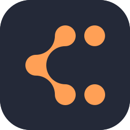

<h1 align="center"> Projeto-de-Sistemas | Mobile</h1>
        <td>As informações principais do projeto estão <a href="https://github.com/MellloJ/Projeto-de-Sistemas">nesse repositório</a></td>
        

<table align="center">
    <tr>
        <td>Home</td>
        <td><a href="/docs/defaults.md">Padrões</a></td>
        <td><a href="plan.md">Planejamento</a></td>
        <td>
            

                
Mais

                <ul style="position: absolute; background: transparent; border: 1px solid #ccc; padding: 10px; list-style: none; border-radius: 10px">
                    <li><a href="/docs/contact.md">Contato</a></li>
                </ul>
            

        </td>
    </tr>
</table>

## Landing Page

<a href="https://jessilver.github.io/trazai-landing-page/">Ir para landing page do Traz Aí</a>

## Sobre

Esse repositório diz respeito à versão mobile do Traz Aí, o aplicativo de entregas especializado para compras de supermercado

Procure os itens nos mercados mais perto de você, escolha com cuidado o que deseja e ainda consiga uma renda extra! Com o Traz Aí, você tem tudo isso! Com uma interface limpa e sem complicações, é possível fazer suas compras do mês no conforto da sua casa, sem se preocupar com sacola e filas enormes, por um preço que cabe no bolso

E mais: Para quem deseja uma renda extra e uma oportunidade de profissão, nossos cargos de separadores e entregadores estão abertos! Basta se cadastrar no aplicativo com os dados necessários e já pode começar os serviços, sem burocracia!

## Tecnologias Utilizadas

###### Para fins de padronização, a parte mobile do sistema utiliza o mesmo backend da parte web, que é feito em django, favorecendo a comunicação por APIs e compatibilidade entre ambos

- Linguagens Utilizadas:

  

- Frameworks:

  

- Banco de Dados:

  

- Ferramentas:

  
  
  
  

<!-- ## Licença

Este projeto está licenciado sob a Licença MIT - veja o arquivo [LICENSE](LICENSE) para mais detalhes. -->